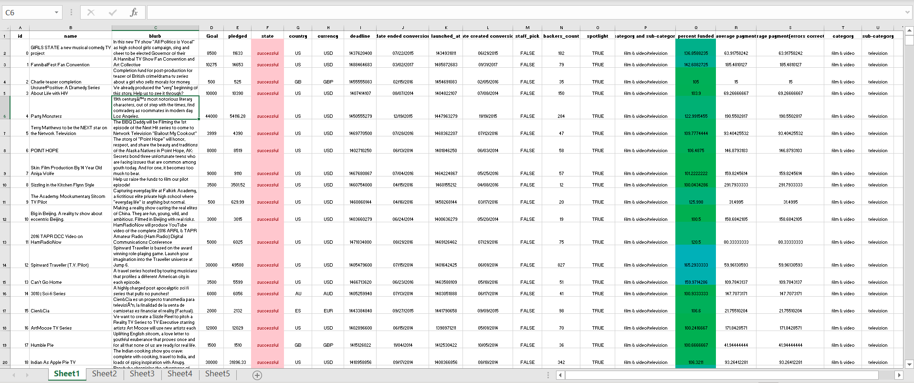

# Starterbook Analysis
# Background
Over two billion dollars have been raised using the massively successful crowdfunding service, Kickstarter, but not every project has found success. Of the over 300,000 projects launched on Kickstarter, only a third have made it through the funding process with a positive outcome.

Since getting funded on Kickstarter requires meeting or exceeding the project's initial goal, many organizations spend months looking through past projects in an attempt to discover some trick to finding success. This project organized and analyzed a database of four thousand past projects in order to uncover any hidden trends.
# Analysis

* Using conditional formatting, each cell in the state column was filled with a different color, depending on whether the associated campaign was "successful," "failed," "cancelled," or is currently "live".

* A new column was created at column O called percent funded that uses a formula to uncover how much money a campaign made towards reaching its initial goal.

* Using conditional formatting, each cell in the percent funded column was filled using a three-color scale. The scale starts at 0 and be a dark shade of red, transitioning to green at 100, and then moving towards blue at 200.

* A new column was created at column P called average donation that uses a formula to uncover how much each backer for the project paid on average.

* Two new columns were created, one called category at Q and another called sub-category at R, which use formulas to split the Category and Sub-Category column into two parts.
___

# Category Statistics

A new sheet was created with a pivot table that analyze the initial worksheet to count how many campaigns were "successful," "failed," "cancelled," or are currently "live" per category.

A stacked column pivot chart was create that can be filtered by country based on the table you have created.
Subcategory Stats

A new sheet with a pivot table was created that will analyze the initial sheet to count how many campaigns were "successful," "failed," "cancelled," or are currently "live" per sub-category.

A stacked column pivot chart was created that can be filtered by country and parent-category based on the table that has been created.
The dates stored within the deadline and launched_at columns are using unix timestamps. A formula was used to convert these timestamps into a normal date.

A new column was created named Date Created Conversion that will use this formula to convert the data contained within launched_at into Excel's Date format.

A new column was created named Date Ended Conversion that use this formula to convert the data contained within deadline into Excel's Date format.
___

Outcomes Based on Launch Date

A new sheet was created with a pivot table with a column of state, rows of Date Created Conversion, values based on the count of state, and filters based on parent category and Years.

A pivot chart line graph was created that visualizes this new table.

A report in Microsoft Word was created to answer the following questions...

What are three conclusions we can make about Kickstarter campaigns given the provided data?
What are some of the limitations of this dataset?
What are some other possible tables/graphs that we could create?
Additional Analysis
A new sheet with 8 columns was created, they are: Goal, Number Successful, Number Failed, Number Canceled, Total Projects, Percentage Successful, Percentage Failed, and Percentage Canceled

In the goal column, twelve rows were created with the following headers...

Less Than 1000
1000 to 4999
5000 to 9999
10000 to 14999
15000 to 19999
20000 to 24999
25000 to 29999
30000 to 34999
35000 to 39999
40000 to 44999
45000 to 49999
Greater than or equal to 50000
Goal Outcomes

The total successful, failed, and canceled projects that were created with goals within those ranges listed above were counted. The Number Successful, Number Failed, and Number Canceled columns were populated with this data.

Each of the values in the Number Successful, Number Failed, and Number Canceled columns were added to populate the Total Projects column. Then, using a mathematic formulae, the percentage of projects which were successful, failed, or were canceled per goal range were found.

A line chart which graphs the relationship between a goal's amount and its chances at success, failure, or cancellation were created.
